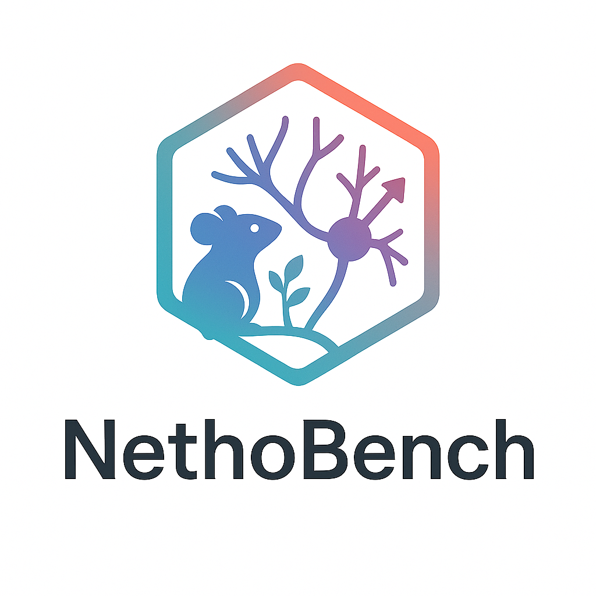

# NethoBench

NethoBench is a benchmark for multimodal brain-behavior models that evaluates neural realism, behavioral realism, and cross-modal plausibility within a single framework. It combines population-level neural metrics spanning distributional structure, temporal dynamics, inter-regional interactions, and low-dimensional geometry with complementary behavioral metrics on pose trajectories, kinematics, motifs, and trajectory statistics. Crucially, it adds an explicit cross-modal axis through neural-to-behavior decoding, behavior-to-neural encoding, latent alignment, and temporal-consistency measures, exposing failure modes that unimodal metrics or task losses alone can miss.



NethoBench outputs:
1) Neuro scores (neural realism)
2) Behavior scores (pose / kinematics realism)
3) Cross-modal scores (neural <-> behavior coupling)
4) A final composite (average over available axes)

## Install
```bash
pip install -e .
```

Recommended (clean environment):
```bash
python -m venv .venv
source .venv/bin/activate
python -m pip install --upgrade pip
python -m pip install -e .
```

## Data expectations
- Files must include `sequenceId` and `itemPosition` for alignment.
- Neural: region columns (one column per region).
- Behavior: keypoint columns with `_X/_Y` pairs (e.g., `CENTER_X`, `CENTER_Y`).
- For multimodal runs, GT and prediction CSVs should contain both neural and behavior columns (or provide a config that lists them).

## CLI
- Neuro scores (single active neural benchmark):
  - `nethobench neuro-scores --gt gt_neural.csv --preds pred_neural.csv`
  - Uses the baseline score cells from `nethobench/notebooks/neuro_metrics.ipynb`.
- Neuro full analysis (executes the full active notebook; saves plots + executed notebook + scores):
  - `nethobench neuro-analysis --gt gt_neural.csv --preds pred_neural.csv --ddconfig configs/data-clean-all.json`
- Behavior-only:
  - `nethobench etho-scores --gt-dir /path/to/gt_dir --inf-dir /path/to/inf_dir`
  - add `--run-notebook` to also execute the bundled ethology notebook headlessly
- Multimodal scores (neuro + behavior + coupling):
  - `nethobench cross-scores --gt gt_multimodal.csv --preds pred_multimodal.csv --config config.json`
- Cross full analysis (headless notebook):
  - `nethobench cross-analysis --gt gt_multimodal.csv --preds pred_multimodal.csv --config config.json`

### Config schema (JSON)
```json
{
  "sequence_key": "sequenceId",
  "time_key": "itemPosition",
  "neuro_cols": ["region1", "region2", "region3"],
  "behavior_parts": ["CENTER", "NOSE", "TAIL_BASE"],
  "body_axis": ["NOSE", "TAIL_BASE"]  // optional override for direction metric
}
```

## Neuro scoring
`nethobench neuro-scores` is driven by the active notebook implementation in `nethobench/notebooks/neuro_metrics.ipynb` via the extracted baseline-cell runner in `nethobench/analysis/neuro_metrics_core_script.py`.

`nethobench neuro-analysis` executes that same notebook end to end and exports the full figure set, including the degradation ladders and the final polar summary dashboard.

The active notebook keeps the established v2 neuro metrics, with three finalized substitutions wired through `nethobench/analysis/refined_neuro_metric_replacements.py`:
- `CC_score01`: lagged cross-correlation matrix agreement stabilized by strong-edge cross-correlation profiles
- `MANI_score01`: persistent-homology lifetime agreement stabilized by local neighborhood geometry
- `TRJDIST_score01`: occupancy and velocity trajectory agreement stabilized by path-feature agreement

The notebook-derived scalar metrics currently include:
- `KL_score01`
- `Mean_score01`
- `MI_score01`
- `Error_score01`
- `QNT_score01`
- `FC_score01`
- `PCA_score01`
- `AUTO_score01`
- `CC_score01`
- `MOM_score01`
- `GRAPH_score01`
- `CCA_score01`
- `MANI_score01`
- `BP_score01`
- `TRJDIST_score01`
- `FINAL_COMPOSITE_SCORE`

The final composite is a weighted arithmetic mean over available metric families:
- distribution
- fidelity
- temporal_spectral
- relational
- geometry

`neuro-scores` runs the baseline metric cells and final composite cell only.
It does not execute the notebook corruption sweeps or the unified degradation dashboard.
Use `neuro-analysis` when you want the full notebook outputs.

## Behavior and cross-modal scoring
- **Behavior** (from EthoBench): position KL, quadrant KL, stationary fraction, velocity/acceleration KL, direction alignment, syllable distribution similarity, and trajectory-shape similarity.
- **Cross-modal**: neural-behavior CCA alignment, bidirectional predictive `R^2`, lead-lag agreement, and a cross-modal composite over available terms.
- Bundled notebooks live under `nethobench/notebooks/`.
- The active neural benchmark notebook is `nethobench/notebooks/neuro_metrics.ipynb`.
- Headless analysis commands save figures, notebook wrappers, and score JSON under `./outputs/...`.

### Composite logic
- If only neuro: composite = neuro composite.  
- If only behavior: composite = behavior composite.  
- If multimodal: composite = average(neuro composite, behavior composite, cross composite) over available (finite) axes.

## Python API
```python
from nethobench import (
    compute_neuro_scores,
    run_neuro_full_analysis,
    compute_etho_scores,
    compute_cross_scores,
    run_ethobench_notebook,   # optional behavior notebook capture
    run_cross_full_analysis,  # optional cross-modal notebook capture
)
```

## Outputs
- `neuro-scores` prints scores with colored arrow bars and always saves a JSON payload. `--json-out` lets you choose the path.
- Intermediate notebook/metric logs are suppressed by default for all CLI commands.
- `neuro-analysis`, `etho-scores --run-notebook`, and `cross-analysis` save figures + executed notebook under `./outputs/.../`.
- `cross-scores` reports per-axis composites and the final multimodal composite.

## Example core-score output (CLI)
```
Neuro scores:
  KL_or_JSD_score01             : 0.xxx
  Mean_score01                  : 0.xxx
  MI_score01                    : 0.xxx
  Error_score01                 : 0.xxx
  QNT_score01                   : 0.xxx
  FC_score01                    : 0.xxx
  PCA_score01                   : 0.xxx
  AUTO_score01                  : 0.xxx
  CC_score01                    : 0.xxx
  MOM_score01                   : 0.xxx
  GRAPH_score01                 : 0.xxx
  CCA_score01                   : 0.xxx
  MANI_score01                  : 0.xxx
  BP_score01                    : 0.xxx
  TRJDIST_score01               : 0.xxx
  family_distribution           : 0.xxx
  family_fidelity               : 0.xxx
  family_temporal_spectral      : 0.xxx
  family_relational             : 0.xxx
  family_geometry               : 0.xxx
  FINAL_COMPOSITE_SCORE         : 0.xxx
```

## Status
- Focused on reproducible metrics; exploratory notebooks (ethology) can still be run via `ethobench`-style capture if you place the notebook under `nethobench/notebooks/`.  
- Cross-modal metrics are light-weight and interpretable; extend with your own in `nethobench/cross.py`.

## License
This project is released under the MIT License. See `LICENSE`.
